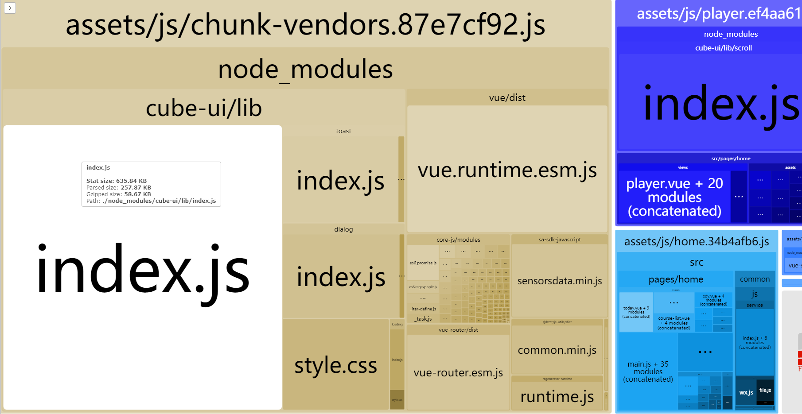

# webpack-bundle-analyzer

先使用`webpack-bundle-analyzer` 工具，看一下包里最大的是啥




其中：
- 包总大小：1.81M
- chunk-vendors-xxx 1.34M
- 其中cube-ui有915K

所以：
先搞cube-ui：


cube-ui 已经针对vue-cli@3开发了一款插件，使用 `vue add cube-ui` 的命令安装插件；
使用之前把，以前的packge.json 和 vue-config.js 中关于cube-ui的设置删除。
参考：
- [官网](https://didi.github.io/cube-ui/#/zh-CN/docs/quick-start)
- [配置说明](https://github.com/cube-ui/cube-template/wiki)

一波操作后，文件的改变为：
1. vue.config.js，新增下面一段代码：
其中， 一个后编译配置， 老是报错，半天没整明白，然后，就没继续搞；
主要把 `partly` 设置为true就可以使用按需引入了。

```
    css: {
        loaderOptions: {
            stylus: {
                'resolve url': true,
                'import': []
            }
        }
    },
    pluginOptions: {
        'cube-ui': {
            postCompile: false,
            theme: false,
            partly: true
        }
    }
```


2. package.json 多了关于 `stylus`, `stylus-loader` 和 `vue-cli-plugin-cube-ui` 的依赖；

选配置的时候，有个 `Use rem layout` 配置，如果配置选了Yes，package.json会出现postcss-px2rem的配置， 把与原本页面里的rem布局搞得很乱，配置在 `postcss` 部分：

```
"postcss": {
    "plugins": {
      "autoprefixer": {},
      "postcss-px2rem": {
        "remUnit": 37.5
      }
    }
  }
```

最后看看疗效：

![第二次打包](images/bundle-analyze/2.png

其中：
- 包总大小：1.11M
- 其中cube-ui有200K